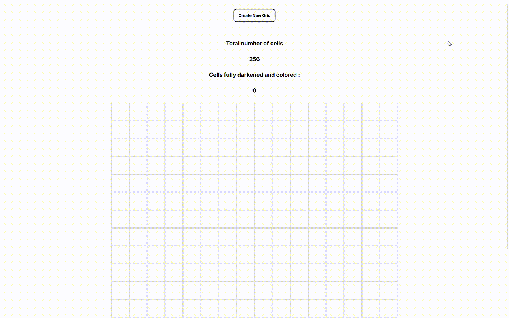

# Etch-a-Sketch

🎨 A simple browser-based Etch-a-Sketch drawing app built with HTML, CSS, and JavaScript.



## ✨ Features

- Interactive grid-based canvas
- Draw by hovering your mouse
- Choose between black and random colors
- Adjustable grid size (from 1x1 up to 100x100)

## 🚀 Live Demo

Check it out here: [Etch-a-Sketch Live](https://dani-sink.github.io/etch-a-sketch/)

## 🛠️ Tech Stack

- HTML
- CSS
- JavaScript

## ⚙️ How to Run Locally

1. Clone the repo:
   ```bash
   git clone https://github.com/dani-sink/etch-a-sketch.git
   ```
2. Open `index.html` in your browser.

   ```

   ```
